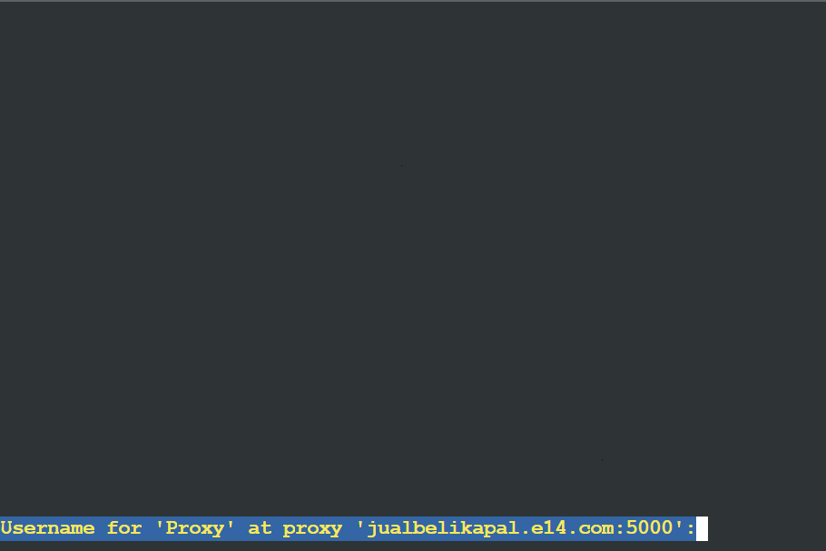
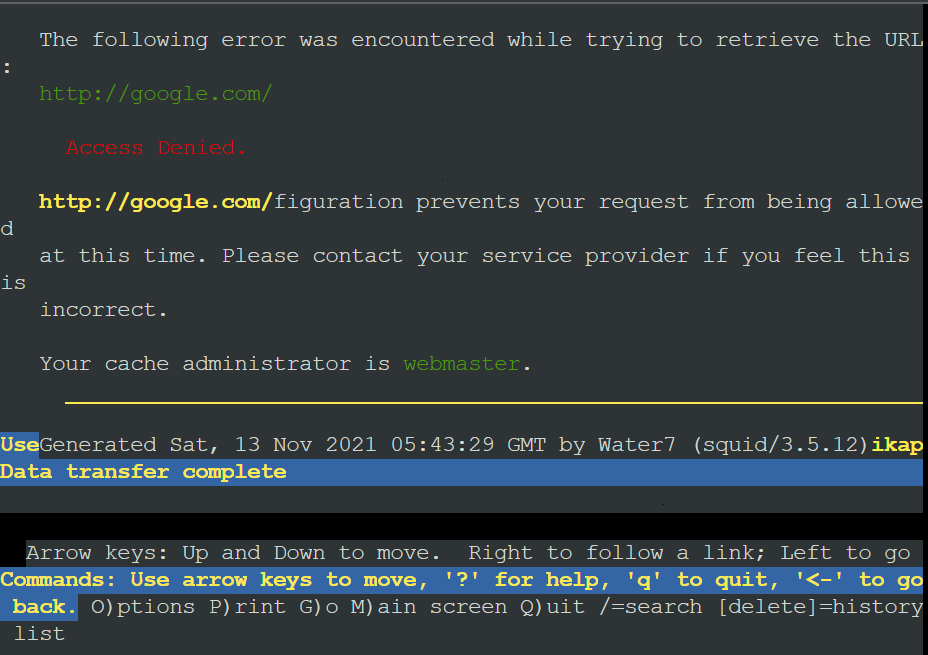

# Jarkom-Modul-3-E14-2021

**Anggota kelompok**:

- Dwi Wahyu Santoso (05111840000121)
- Khaela Fortunela (05111940000057)
- Husin Muhammad Assegaff (05111940000127)

---

## Tabel Konten

A. Jawaban

- [Soal 1](#soal-1)
- [Soal 2](#soal-2)
- [Soal 3-6](#soal-3-6)
- [Soal 7](#soal-7)
- [Soal 8](#soal-8)
- [Soal 9](#soal-9)
- [Soal 10](#soal-10)
- [Soal 11](#soal-11)
- [Soal 12](#soal-12)
- [Soal 13](#soal-13)

B. Kendala

- [Kendala](#kendala)

---

## Prefix IP

Prefix IP Address kelompok kami adalah `10.36`

## Persiapan

Membuat topologi sebagai berikut


Mengatur _network configuration_ pada

- router **Foosha**
- Node **EniesLobby**, **Water7**, dan **Jipangu** <br>

untuk menjalankan instalasi yang diperlukan

1. Foosha

   ```
   auto eth0
   iface eth0 inet dhcp

   auto eth1
   iface eth1 inet static
      address 10.36.1.1
      netmask 255.255.255.0

   auto eth2
   iface eth2 inet static
      address 10.36.2.1
      netmask 255.255.255.0

   auto eth3
   iface eth3 inet static
      address 10.36.3.1
      netmask 255.255.255.0
   ```

2. EniesLobby

   ```
   auto eth0
   iface eth0 inet static
      address 10.36.2.2
      netmask 255.255.255.0
      gateway 10.36.2.1
   ```

3. Water7

   ```
   auto eth0
   iface eth0 inet static
      address 10.36.2.3
      netmask 255.255.255.0
      gateway 10.36.2.1
   ```

4. Jipangu
   ```
   auto eth0
   iface eth0 inet static
      address 10.36.2.4
      netmask 255.255.255.0
      gateway 10.36.2.1
   ```

Kemudian, jalankan perintah ini pada **Foosha**

```
iptables -t nat -A POSTROUTING -o eth0 -j MASQUERADE -s 10.36.0.0/16
```

Dan, jalankan perintah ini pada **EniesLobby**, **Water7**, dan **Jipangu**

```
echo nameserver 192.168.122.1 > /etc/resolv.conf
```

## Soal 1

Luffy bersama Zoro berencana membuat peta tersebut dengan kriteria EniesLobby sebagai DNS Server, Jipangu sebagai DHCP Server, Water7 sebagai Proxy Server

**Pembahasan:**

1. Instalasi ISC-DHCP-Server pada **Jipangu**
   - Update package lists di **Jipangu**
     ```
     apt-get update
     ```
   - Install isc-dhcp-server
     ```
     apt-get install isc-dhcp-server -y
     ```
   - Pastikan isc-dhcp-server telah terinstall dengan perintah
     ```
     dhcpd --version
     ```
2. Konfigurasi DHCP Server pada **Jipangu**
   - edit file konfigurasi isc-dhcp-server
     ```
     nano /etc/default/isc-dhcp-server
     ```
   - interface yang diberikan layanan DHCP adalah **eth0**. Maka, pada bagian baris akhir di file `/etc/default/isc-dhcp-server` diubah menjadi
     ```
     INTERFACES = "eth0"
     ```
3. Konfigurasi Proxy Server pada **Water7**
   - Update package lists di **Water7**
     ```
     apt-get update
     ```
   - install squid
     ```
     apt-get install squid -y
     ```
   - Cek status Squid dan pastikan sudah _running_
     ```
     service squid status
     ```
   - Backup file konfigurasi default yang telah disediakan Squid
     ```
     mv /etc/squid/squid.conf /etc/squid/squid.conf.bak
     ```
   - Buat konfigurasi Squid baru
     ```
     nano /etc/squid/squid.conf
     ```
   - Kemudian, tambahkan
     ```
     http_port 8080
     visible_hostname Water7
     ```
   - Restart squid
     ```
     service squid restart
     ```
     Pastikan satus telah **OK**

## Soal 2

Foosha sebagai DHCP Relay

**Pembahasan:**

1.  Instalasi ISC-DHCP-Relay pada **Foosha**

    - Update package lists di **Foosha**
      ```
      apt-get update
      ```
    - Install isc-dhcp-relay
      ```
      apt-get install isc-dhcp-relay
      ```
    - Saat instalasi berlangsung, diminta untuk input **SERVERS** yang diisi dengan IP **Jipangu**
      ```
      10.36.2.4
      ```
    - Kemudian, diminta juga input **INTERFACES** yakni
      ```
      eth1 eth2 eth3
      ```
    - Atau juga dapat diedit pada file **/etc/default/isc-dhcp-relay**
      ```
      nano /etc/default/isc-dhcp-relay
      ```
    - Lalu dapat diubah pada bagian **SERVERS** dan **INTERFACES**

      ```
      # Defaults for isc-dhcp-relay initscript
      # sourced by /etc/init.d/isc-dhcp-relay
      # installed at /etc/default/isc-dhcp-relay by the maintainer scripts

      #
      # This is a POSIX shell fragment
      #

      # What servers should the DHCP relay forward requests to?
      SERVERS="10.36.2.4"

      # On what interfaces should the DHCP relay (dhrelay) serve DHCP requests?
      INTERFACES="eth1 eth2 eth3"

      # Additional options that are passed to the DHCP relay daemon?
      OPTIONS=""
      ```

    - Kemudian, restart isc-dhcp-relay
      ```
      service isc-dhcp-relay restart
      ```

## Soal 3 - 6

- **No 3**
  Client yang melalui Switch1 mendapatkan range IP dari 10.36.1.20 - 10.36.1.99 dan 10.36.1.150 - 10.36.1.169
- **No 4**
  Client yang melalui Switch3 mendapatkan range IP dari 10.36.3.30 - 10.36.3.50
- **No 5** Client mendapatkan DNS dari EniesLobby dan client dapat terhubung dengan internet melalui DNS tersebut.
- **No 6** Lama waktu DHCP server meminjamkan alamat IP kepada Client yang melalui Switch1 selama 6 menit sedangkan pada client yang melalui Switch3 selama 12 menit. Dengan waktu maksimal yang dialokasikan untuk peminjaman alamat IP selama 120 menit.

**Pembahasan:**

1. Install bind9 pada EniesLobby dan jadikan sebagai DNS Forwaders

   - install bind9
     ```
     apt-get install bind9 -y
     ```
   - Edit file /etc/bind/named.conf.options pada server EniesLobby dengan uncomment pada
     ```
     forwarders {
         192.168.122.1;
     };
     ```
   - comment
     ```
     //dnssec-validation auto;
     ```
   - tambahkan
     ```
     allow-query{any;};
     ```

2. Settings DHCP Server pada **Jipangu**

   - edit file pada `/etc/dhcp/dhcpd.conf`
     ```
     nano /etc/dhcp/dhcpd.conf
     ```
   - Tambahkan script berikut

     ```
     subnet 10.36.2.0 netmask 255.255.255.0{
     }

     subnet 10.36.1.0 netmask 255.255.255.0{
         range 10.36.1.20 10.36.1.99;
         range 10.36.1.150 10.36.1.169;
         option routers 10.36.1.1;
         option broadcast-address 10.36.1.255;
         option domain-name-servers 10.36.2.2;
         default-lease-time 360;
         max-lease-time 7200;
     }

     subnet 10.36.3.0 netmask 255.255.255.0{
         range 10.36.3.30 10.36.3.50;
         option routers 10.36.3.1;
         option broadcast-address 10.36.3.255;
         option domain-name-servers 10.36.2.2;
         default-lease-time 720;
         max-lease-time 7200;
     }
     ```

     Keterangan : <br>
     a. **Jawaban dari No 3** (Switch 1)

     ```
     range 10.36.1.20 10.36.1.99;
     range 10.36.1.150 10.36.1.169;
     ```

     b. **Jawaban dari No 4** (Switch 3)

     ```
     range 10.36.3.30 10.36.3.50;
     ```

     c. **Jawaban dari No 6**

     - Switch 1

       ```
       default-lease-time 360;
       max-lease-time 7200;
       ```

     - Switch 3
       ```
        default-lease-time 720;
        max-lease-time 7200;
       ```

   - Restart DHCP Server
     ```
     service isc-dhcp-server restart
     ```

3. Testing pada client (**Jawaban dari nomor 5**)
   - Edit _network configuration_ pada setiap client menjadi
     ```
     auto eth0
     iface eth0 inet dhcp
     ```
   - Kemudian, restart setiap client dengan cara buka GNS3 → klik kanan node → klik Stop → klik kanan kembali node → klik Start
   - Lalu, periksa ip setiap node dengan perintah
     ```
     ifconfig eth0
     ```
     a. Loguetown
     
     b. Alabasta
     
     c. Skypie
     
     d. Tottoland
     
   - Juga periksa nameserver pada setiap client yang harusnya berisi IP DNS, yakni IP EniesLobby <br>
     a. Loguetown
     
     b. Alabasta
     
     c. Skypie
     
     d. Tottoland
     
   - Jangan lupa jalankan `service bind9 restart` pada EniesLobby sebelum `ping -w 3 google.com` untuk memastikan terhubung dengan internet <br>
     a. Loguetown
     
     b. Alabasta
     
     c. Skypie
     
     d. Tottoland
     

## Soal 7

Luffy dan Zoro berencana menjadikan Skypie sebagai server untuk jual beli kapal yang dimilikinya dengan alamat IP yang tetap dengan IP 10.36.3.69

**Pembahasan:**

1. Konfigurasi DHCP Server pada **Jipangu**
   - Buka file konfigurasi `isc-dhcp-server` pada **Jipangu**
     ```
     nano /etc/dhcp/dhcpd.conf
     ```
   - script berikut ini
     ```
     host Skypie {
         hardware ethernet 'hwaddress_milik_Skypie';
         fixed-address 10.36.3.69;
     }
     ```
   - Restart DHCP Server
     ```
     service isc-dhcp-server restart
     ```
2. Konfigurasi DHCP Client pada **Skypie**
   - Buka file `/etc/network/interfaces`
     ```
     nano /etc/network/interfaces
     ```
   - Tambahkan script
     ```
     hwaddress ether 'hwaddress_milik_Skypie'
     ```
   - Kemudian, restart node Skypie
   - Lalu dicoba periksa IP pada Skypie dengan perintah
     ```
     ifconfig eth0
     ```
     

**Catatan:**
Untuk mencari `hwadress_milik_Skypie` dapat dilakukan perintah `ifconfig eth0` pada **Skypie**. kemudian, disalin bagian yang ditandai pada gambar di bawah ini


## Soal 8

Pada Loguetown, proxy harus bisa diakses dengan nama jualbelikapal.e14.com dengan port yang digunakan adalah 5000

**Pembahasan:**

1. Edit konfigurasi squid pada **Water7**

   - Buka file konfigurasi Squid pada **Water7**
     ```
     nano /etc/squid/squid.conf
     ```
   - Ubah isi file konfigurasi menjadi

     ```
     http_port 5000
     visible_hostname Water7
     http_access allow all
     ```

   - Restart squid
     ```
     service squid restart
     ```

2. Konfigurasi bind9 pada **EniesLobby**

   - Buka file konfigurasi pada `/etc/bind/named.conf.local`

     ```
     nano /etc/bind/named.conf.local
     ```

   - Tambahkan sintaks berikut
     ```
     zone "jualbelikapal.e14.com" {
         type master;
         file "/etc/bind/kaizoku/jualbelikapal.e14.com";
     };
     ```
   - Buat folder `kaizoku` pada `/etc/bind`

     ```
     mkdir /etc/bind/kaizoku
     ```

   - Copykan file `db.local` pada path `/etc/bind` ke dalam folder `kaizoku` yang baru saja dibuat dan ubah namanya menjadi jualbelikapal.e14.com

     ```
     cp /etc/bind/db.local /etc/bind/kaizoku/jualbelikapal.e14.com
     ```

   - Kemudian, buka file tersebut dan edit seperti gambar di bawah ini

     ```
     nano /etc/bind/kaizoku/jualbelikapal.e14.com
     ```

     

   - Restart bind9
     ```
     service bind9 restart
     ```

3. Konfigurasi proxy pada **Loguetown**
   - Untuk memeriksa proxy terhubung dengan internet dapat dilakukan instalasi lynx
     ```
     apt-get update
     apt-get install lynx -y
     ```
   - Mengaktifkan proxy dengan sintaks
     ```
     export http_proxy="http://jualbelikapal.e14.com:5000"
     ```
   - Periksa apakah konfigurasi berhasil dengan sintaks
     ```
     env | grep -i proxy
     ```
   - Lalu, dicoba ping pada google.com
     ```
     ping google.com
     ```
     

## Soal 9

Agar transaksi jual beli lebih aman dan pengguna website ada dua orang, proxy dipasang autentikasi user proxy dengan enkripsi MD5 dengan dua username, yaitu luffybelikapale14 dengan password luffy_e14 dan zorobelikapale14 dengan password zoro_e14

**Pembahasan**

1. Ubah konfigurasi squid pada **Water7**

   - Install apache2-utils
     ```
     apt-get update
     apt-get install apache2-utils -y
     ```
   - Membuat username dan password baru <br>
     1. Username : luffybelikapale14 dan Password : luffy_e14
        ```
        htpasswd -c -m -b /etc/squid/passwd luffybelikapale14 luffy_e14
        ```
     2. Username : zorobelikapale14 dan Password : zoro_e14
        ```
        htpasswd -m -b /etc/squid/passwd zorobelikapale14 zoro_e14
        ```
   - Buka file konfigurasi squid
     ```
     nano /etc/squid/squid.conf
     ```
   - Edit konfigurasi tersebut menjadi

     ```
     http_port 5000
     visible_hostname Water7

     auth_param basic program /usr/lib/squid/basic_ncsa_auth /etc/squid/passwd
     auth_param basic children 5
     auth_param basic realm Proxy
     auth_param basic credentialsttl 2 hours
     auth_param basic casesensitive on
     acl USERS proxy_auth REQUIRED
     http_access allow USERS
     ```

   - Restart squid
     ```
     service squid restart
     ```

2. Testing pada **Loguetown**
   - Mencoba lynx pada google.com
     
     

## Soal 10

Transaksi jual beli tidak dilakukan setiap hari, oleh karena itu akses internet dibatasi hanya dapat diakses setiap hari Senin-Kamis pukul 07.00-11.00 dan setiap hari Selasa-Jum’at pukul 17.00-03.00 keesokan harinya (sampai Sabtu pukul 03.00)

**Pembahasan**

1. Ubah konfigurasi squid pada **Water7**

   - Buat file baru bernama `acl.conf` di folder squid
     ```
     nano /etc/squid/acl.conf
     ```
   - Lalu, tambahkan konfigurasi berikut ini
     ```
     acl AVAILABLE_WORKING time MTWH 07:00-11:00
     acl AVAILABLE_WORKING time TWHF 17:00-23:59
     acl AVAILABLE_WORKING time WHFA 00:00-03:00
     ```
   - Kemudian, buka file `/etc/squid/squid.conf`
     ```
     nano /etc/squid/squid.conf
     ```
   - Dan ubah menjadi sebagai berikut

     ```
      include /etc/squid/acl.conf

      http_port 5000
      visible_hostname Water7
      #http_access allow all


      auth_param basic program /usr/lib/squid/basic_ncsa_auth /etc/squid/passwd
      auth_param basic children 5
      auth_param basic realm Proxy
      auth_param basic credentialsttl 2 hours
      auth_param basic casesensitive on
      acl USERS proxy_auth REQUIRED
      http_access allow USERS AVAILABLE_WORKING
      http_access deny all
     ```

   - Lalu, restart squid
     ```
     service squid restart
     ```

2. Testing pada **Loguetown**
   - Mencoba lynx pada google.com
     
     Terjadi _access denied_ karena diakses bukan pada waktu yang diperbolehkan

## Soal 11

Agar transaksi bisa lebih fokus berjalan, maka dilakukan redirect website agar mudah mengingat website transaksi jual beli kapal. Setiap mengakses google.com, akan diredirect menuju super.franky.yyy.com dengan website yang sama pada soal shift modul 2. Web server super.franky.yyy.com berada pada node Skypie

**Pembahasan**

1. Pada EniesLobby buat forlder baru `mkdir /etc/bind/kaizoku` untuk konfigurasi DNS. Buat file baru `vim /etc/bind/kaizoku/franky.e14.com` kemudian tambahkan konfigurasi berikut.
2. Buka file `vim /etc/bind/named.conf.options` dan tambahkan konfigurasi berikut.
3. Buka file `vim /etc/bind/named.conf.local` dan tambahkan konfigurasi berikut.
4. Restart Bind9 dengan cara `service bind9 restart`.
5. Pada Skypie install package-package yang dibutuhkan seperti command di bawah ini.
   ```
   apt-get update
   apt-get install wget -y
   apt-get install apache2 -y
   apt-get install libapache2-mod-php7.0 -y
   apt-get install unzip -y
   ```
6. Buat file baru `vim /etc/apache2/sites-available/super.franky.e14.com.conf` dan tambahkan configurasi berikut.
7. Aktifkan site yang baru dibuat sengan menjalankan `a2ensite super.franky.e14.com.conf`.
8. Download folder super.franky yang telah disediakan di modul sebelumnya untuk resource di folder `/var/www` dengan menjalankan perintah berikut.
   ```
   wget https://raw.githubusercontent.com/FeinardSlim/Praktikum-Modul-2-Jarkom/main/super.franky.zip
   unzip super.franky.zip
   mv super.franky /var/www/super.franky.e14.com
   ```
9. Restart Apache2 untuk menerapkan perubahan dengan menjalakan `service apache2 restart`.
10. Pada Water7 buka file `/etc/squid/squid.conf` dan tambahkan konfigurasi berikut.
11. Untuk mengecek hasilnya, pada Loguetown jalankan `lynx google.com`. Maka hasilnya akan menunjukan seperti gambar di bawah ini.

## Soal 12

Saatnya berlayar! Luffy dan Zoro akhirnya memutuskan untuk berlayar untuk mencari harta karun di super.franky.e14.com. Tugas pencarian dibagi menjadi dua misi, Luffy bertugas untuk mendapatkan gambar (.png, .jpg), sedangkan Zoro mendapatkan sisanya. Karena Luffy orangnya sangat teliti untuk mencari harta karun, ketika ia berhasil mendapatkan gambar, ia mendapatkan gambar dan melihatnya dengan kecepatan 10 kbps.

**Pembahasan**

1. Untuk membatasi ekstensi file yang dapat diunduh, maka ditambahkan line berikut pada `/etc/squid/squid.conf` di **Water7**. Digunakan ACl url_regex untuk membatasi file yang dapat diunduh hanya yang memiliki ekstensi .png dan .jpg.

   `acl multimedia url_regex -i \.png$ \.jpg$`

2. Selanjutnya karena batasan ekstensi yang dapat diunduh hanya untuk Luffy, maka ditambahkan line dibawah untuk identifikasi user mana yang diterapkan aturan ini.

   `acl bar proxy_auth luffybelikapale14`

3. Untuk mengendalikan besarnya bandwidth pada pengunduhan maka digunakan delay pools. Saat ini hanya diperlukan 1 delay pools maka ditambahkan line berikut.

   `delay_pools 1`

4. Selanjutnya untuk tipe delay, cukup digunakan delay class jenis 1.

   `delay_class 1 1`

5. Kemudian karena bandwidth dibatasi pada 10 kbps, maka dilakukan perhitungan berikut.
   10 kbps = 10000 bit per sec
   10000 bit per sec/8 = 1250 Byte per sec
   <<<<<<< HEAD

   Sehingga parameter delay pools adalah sebagai berikut.

   Format dari delay_parameter adalah restore/max.
   Restore menunjukkan maksimum kecepatan data yang dapat dilewatkan bila harga max sudah terlampaui, dalam satuan bytes/second.  
    Sedangkan max menunjukkan besar-nya file atau bucket yang dapat dilewatkan tanpa melalui proses delay, dalam satuan bytes.
   Karena pembatasan perlu dilakukan pada proses mendapatkan gambar dan melihatnya, maka pembatasan kecepatan sudah dilakukan sebelum pengunduhan file.
   Agar kecepatan tidak melampaui 10 kbps, maka nilai max diperkecil. Misa kita tentukan batasnya 1 KB.

   `delay_parameters 1 1250/125`

   `delay_parameters 1 1250/1250`

6. Selanjutnya dilakukan setting akses-akses untuk delay pool. Jika user terlist di `bar`, maka batasan `multimedia` diterapkan.

   `delay_access 1 allow bar multimedia`

   Karena hanya Luffy yang dapat mengunduh file dengan ekstensi (.png, .jpg), maka akses user lain ke file terhadap ekstensi tersebut ditolak.

   `delay_access 1 deny all`

Tambahan: `http_access deny all` dipindah ke line paling akhir.

Sehingga yang harus ditambahkan pada `/etc/squid/squid.conf` adalah sebagai berikut.

```
   acl multimedia url_regex -i \.png$ \.jpg$
   acl bar proxy_auth luffybelikapale14

   delay_pools 1
   delay_class 1 1
   delay_parameters 1 1250/1250
   delay_access 1 allow bar multimedia
   delay_access 1 deny all
```


Selanjutnya dilakukan testing pada **Loguetown**.

## Soal 13

Sedangkan, Zoro yang sangat bersemangat untuk mencari harta karun, sehingga kecepatan kapal Zoro tidak dibatasi ketika sudah mendapatkan harta yang diinginkannya.

**Pembahasan**

Berdasarkan soal ini, kecepatan Zoro tidak dibatasi saat melihat file, namu kemungkinan dibatasi saat pengunduhan. Maka dari itu, ditambahkan delay pool satu lagi untuk Zoro. Ukuran file terkecil pada website super.franky.e14.com adalah sekitar 20 KB. Sehingga ketika max 20 KB hit, maka kecepatan di restore tidak dibatasi lagi.

```
   acl multimedia url_regex -i \.png$ \.jpg$
   acl bar proxy_auth luffybelikapale14
   acl foo proxy_auth zorobelikapale14

   delay_pools 2
   delay_class 1 1
   delay_parameters 1 1250/1250
   delay_access 1 allow bar multimedia
   delay_access 1 deny all

   delay_class 2 1
   delay_parameters 2 -1/20000
   delay_access 2 allow foo
   delay_access 2 deny all
```

## Kendala

Kendala yang dialami kelompok kami pada pengerjaan nomor 12 dan 13
